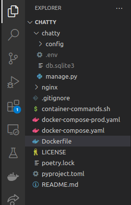

# django-nginx-gunicorn-deploy-using-docker-for-aws
A base template setup for a django app to be deployed using docker on aws ec2 instance

## Getting Started

### Prerequisites
Before you begin, make sure you have the following installed on your local machine:
- Docker
- Docker Compose
## Knowledge of poetry is required as its used to add new packages
https://python-poetry.org/
## other packages
- decouple ( https://pypi.org/project/python-decouple/ ) for reading env files
## for CI/CD using aws it will be handy if you know how to use aws secrets manager
- aws secrets manager (you will need to figure out how to download you secrets and export in the enviroment)

### Installation
1. Clone this repository to your local machine.
2. Navigate to the project directory: `cd django-nginx-gunicorn-deploy-using-docker-for-aws`
3. Copy contents to your root app folder
4. change config folder name to your folder. Assuming you have a app called chatty the directory wil look something like this.

5. amend docker  files to path your app folders
6. Build the Docker image: `docker-compose build`.
7. Start the Docker containers: `docker-compose up -d`.

## Configuration

### Django Settings
Update the Django settings in the `config/settings.py` file according to your project requirements.

### Nginx Configuration
Modify the Nginx configuration file `config/nginx/nginx.conf` to suit your needs. You can specify additional server blocks or customize the existing ones.

### Gunicorn Configuration
Adjust the Gunicorn configuration in the `config/gunicorn/gunicorn.conf.py` file as per your application's requirements.

## Deployment

### Deploying to AWS EC2
1. Create an EC2 instance on AWS.
2. SSH into the EC2 instance.
3. Copy the project files to the EC2 instance using SCP or any other method.
4. Install Docker and Docker Compose on the EC2 instance.
5. Navigate to the project directory: `cd django-nginx-gunicorn-deploy-using-docker-for-aws`.
6. Build the Docker image: `docker-compose build`.
7. Start the Docker containers: `docker-compose up -d`.

## Usage

### Accessing the Django App
Once the containers are up and running, you can access the Django app by navigating to `http://<your-ec2-instance-ip>/` in your web browser.

### Logs
To view the logs of the running containers, use the following command: `docker-compose logs -f`.

### Stopping the Containers
To stop the running containers, run: `docker-compose down`.

